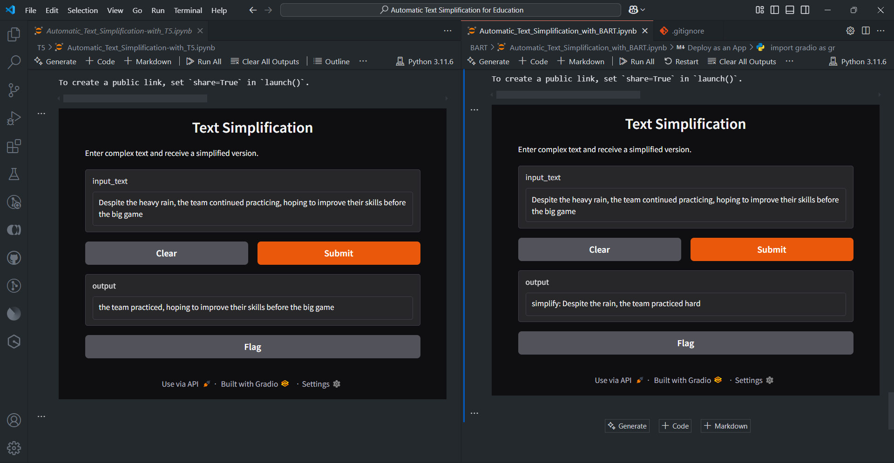

# Text Simplification Using T5 and BART Models

## 📌 Project Overview

This project focuses on **Text Simplification Using T5 and BART Models** using **T5 (Text-to-Text Transfer Transformer)** and **BART (Bidirectional and Auto-Regressive Transformers)** models. The goal is to simplify complex text while maintaining its original meaning, making information more accessible for individuals with limited reading proficiency, including non-native speakers and those with cognitive challenges.

## 🏆 Key Features

-   Utilizes **T5 and BART** transformer-based models.
-   Trained on **10,000 complex-simplified sentence pairs** from sources like **Simple Wikipedia** and **Newsela**.
-   Evaluated using **BLEU, ROUGE, and SARI** scores.
-   Implements **data preprocessing, augmentation, and fine-tuning** for optimal results.
-   Supports **text simplification for academic, technical, and general content**.

## 🚀 Installation & Setup

1. **Clone the Repository**

    ```bash
    git clone https://github.com/Dipan46/Text-Simplification-Using-T5-and-BART-Models.git
    cd Text-Simplification-Using-T5-and-BART-Models
    ```

2. **Create a Virtual Environment (Optional)**

    ```bash
    python -m venv venv
    source venv/bin/activate  # On Windows: venv\Scripts\activate
    ```

3. **Install Dependencies**

    ```bash
    pip install -r requirements.txt
    ```

4. **Run the Jupyter Notebooks**
    ```bash
    jupyter notebook
    ```

## 📊 Dataset Details

-   **Sources:** Simple Wikipedia, Newsela, and manually simplified texts.
-   **Size:** 10,000 sentence pairs.
-   **Preprocessing:**
    -   Text cleaning (removing special characters, lowercasing).
    -   Sentence alignment and tokenization.
    -   Filtering redundant or excessively long sentences.
    -   Data augmentation via **back-translation** and **paraphrasing**.

## 🏗️ Model Training & Evaluation

### **T5 Model**

-   Converts text simplification into a **text-to-text** task.
-   Fine-tuned using **task-specific prefixes** (e.g., `simplify: <text>`).
-   Pretrained on diverse NLP tasks for better generalization.

### **BART Model**

-   Uses a **bidirectional encoder** and **autoregressive decoder**.
-   Pre-trained with a **denoising autoencoder** objective.
-   Effective for **sequence-to-sequence** transformations.

### **Performance Comparison**

| Model    | BLEU | ROUGE-1 | ROUGE-2 | ROUGE-L | SARI |
| -------- | ---- | ------- | ------- | ------- | ---- |
| **T5**   | 37.8 | 48.2    | 23.5    | 45.1    | 39.4 |
| **BART** | 41.5 | 52.7    | 27.8    | 49.3    | 38.7 |


### **Output**




📌 **Findings:**

-   **BART** outperforms T5 in **BLEU and ROUGE scores**, meaning it retains better semantic fidelity.
-   **T5** achieves a **higher SARI score**, indicating stronger simplification capabilities.

## 🔍 Key Observations

-   **BART** is better for **technical or academic text** where retaining information is crucial.
-   **T5** is more suitable for **readability-focused simplification**, making text easier to understand.
-   Both models benefit from **beam search decoding** for improved output fluency.

## 🔮 Future Work

-   Expanding dataset size with **more diverse and domain-specific texts**.
-   Exploring **human evaluation** for readability and fluency assessment.
-   Extending the models to **multilingual text simplification**.

## 📜 Citation

If you use this project for research, please cite:

```
@article{bhattacharjee2025textsimplification,
  author    = {Soma Das, Dipan Basak, Abir Bhattacharjee},
  title     = {Text Simplification Using T5 and BART Models},
  journal   = {Institute of Engineering and Management},
  year      = {2025}
}
```
